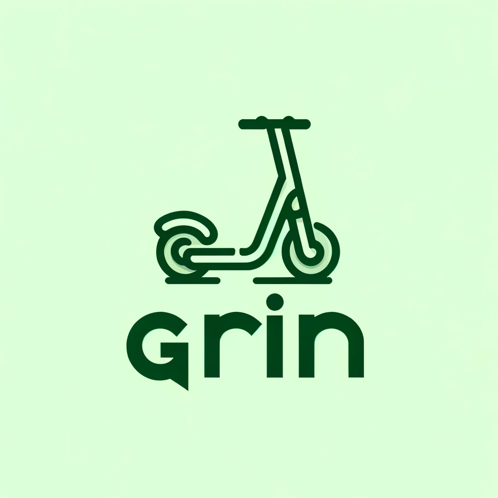

# Grin - Bike Sharing Service



## Introduction

- **Grin**: A bike-sharing service located in **Berlin**, tailored for tourists and locals.
- **Location**: Berlin is an ideal hub for this service due to its famous tourist attractions such as **Brandenburg Gate** and **Alexanderplatz**.
- **Unique Feature**: Grin provides in-app navigation with real-time vehicle locations and offers users discounts at partner restaurants and tourist spots.

---

## Project Overview

We used various APIs such as:

- **Meteostat**: Weather data API.
- **Foursquare**: Business and place data API.
- **Google APIs**: Location and routing services.
- **Kaggle Weather Dataset**: Historical weather and rental business data.

The collected data was cleaned and processed to make data-driven decision: finding optimal places with max bike traffic to place our vehicles to maximize usage frequency.
---

## Data Cleaning & Processing

To make informed business decisions, we cleaned and processed the collected data, filled missing values, and merged datasets from different sources.

We simulated Berlin's bike traffic, conducted Exploratory Data Analysis on it, and used **Streamlit** to create a demo of our in-app navigation with real-time vehicle locations.

---

## Project Structure

The project is organized into the following directories and scripts:
```bash
Redstone/
│
├── data/                              # Contains all the project saved datasets
│
├── notebooks/                         # Jupyter notebooks for analysis and exploration
│   ├── AnalysisExploratory.ipynb      # Exploratory data analysis
│   ├── DataAnalysis.ipynb             # Detailed data analysis
│   └── ExplorationAPI.ipynb           # API exploration notebook
│
├── scripts/                           # Python scripts
│   ├── maps.py                        # Script to generate map visualizations
│   └── project_vis.py                 # Streamlit visualization script
│
├── README.md                          # Project README file
│
└── requirements.txt                   # Python dependencies for the project

---
```
## Running the Streamlit App

To run the **Streamlit** app and visualize the data interactively:

1. Install the required Python packages:
```bash
pip install -r Redstone/requirements.txt
```

2.	Launch the Streamlit app:
```bash
streamlit run Redstone/scripts/project_vis.py
```
